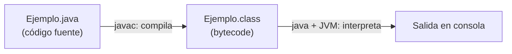

# Tema 1 — Proyectos de desarrollo de programas


## Índice
1. [Introducción](#1-introducción)
2. [Concepto de algoritmo](#2-concepto-de-algoritmo)
3. [Fases del desarrollo de software](#3-fases-del-desarrollo-de-software)
4. [Lenguajes de programación](#4-lenguajes-de-programación)
5. [Bloques de un programa informático](#5-bloques-de-un-programa-informático)
6. [Compiladores e intérpretes](#6-compiladores-e-intérpretes)
7. [Herramientas de desarrollo: VS Code](#7-herramientas-de-desarrollo-vs-code)
8. [Tu primer programa](#8-tu-primer-programa)
9. [Errores típicos al empezar](#9-errores-típicos-al-empezar)

---

## 1. Introducción

Para desarrollar cualquier programa hay que conocer la tecnología que hay por debajo: qué
tipos de lenguajes existen, cómo se traduce lo que escribimos a algo que el procesador
entienda, y con qué herramientas se trabaja. Cuanto más cerca está un lenguaje del
procesador, más difícil es de leer para una persona; por eso en clase usaremos un
**lenguaje de alto nivel — Java**, mucho más cercano al lenguaje natural.

Ese "acercar el lenguaje a la persona" tiene un coste: el código que escribimos no lo
entiende el procesador directamente, hace falta traducirlo. De eso trata buena parte de
este tema.

---

## 2. Concepto de programa y algoritmo

Un **programa** es una secuencia de instrucciones que el ordenador ejecuta **en orden**,
una detrás de otra, para resolver una tarea. Esa lista de pasos pensada antes de escribir
código se llama **algoritmo** — como una receta de cocina.

- **Algoritmo = la idea:** pasos precisos para resolver un problema, sin ambigüedad, sin depender de ningún lenguaje. Como una receta de cocina.
- **Programa = la implementación:** ese algoritmo escrito en un lenguaje concreto para que el ordenador lo ejecute.
- **Java es el lenguaje que usaremos:** fácil de leer y escribir, muy usado en el mundo real.

💡 Algoritmo: "sumar las notas y dividir entre cuántas hay". Programa: ese mismo algoritmo escrito en Java, con código para pedir las notas y mostrar el resultado.

Los algoritmos controlan su flujo con tres tipos de estructuras — las veremos a fondo en
temas posteriores, pero conviene que las tengas ya en la cabeza:

| Estructura | Qué hace |
|---|---|
| Secuencial | Las instrucciones se ejecutan una tras otra |
| Condicional | Permite tomar decisiones (`if`) |
| Repetitiva | Permite repetir acciones (`while`, `for`) |

---

## 3. Fases del desarrollo de software

El desarrollo de software se organiza, en general, en tres fases:

1. **Análisis y diseño** — se estudia qué necesita el software y cómo se va a resolver
   (qué datos hacen falta, qué algoritmos usar). Aquí no hace falta bajar a mucho
   detalle, pero un fallo grave en esta fase sale muy caro más adelante.
2. **Codificación y depuración** — se traduce el diseño a un lenguaje de programación
   concreto (Java, en nuestro caso), y se corrigen los errores que van apareciendo.
3. **Mantenimiento** — una vez el software está en uso, se corrigen errores no
   detectados antes y se añaden funcionalidades nuevas.

> 💬 **Recuerda que...** un buen análisis y diseño puede ser la diferencia entre el éxito
> y el fracaso de un proyecto. Se suele menospreciar, pero es determinante.

Este tema (y prácticamente todo el módulo) se centra en la fase 2: **codificación**.

---

## 4. Lenguajes de programación

Existen tres grandes grupos de lenguajes, de menos a más cercanos a las personas:

| Tipo | Cómo es | Ejemplo |
|---|---|---|
| **Lenguaje máquina** | Solo ceros y unos. Lo único que entiende el procesador directamente. Depende de cada procesador. | `10110000 01100001` |
| **Lenguaje ensamblador** | Comandos cortos (normalmente de 3 letras) que representan operaciones. Sigue siendo de bajo nivel. | `SUB AX, BX, CX` |
| **Lenguaje de alto nivel** | Palabras y reglas cercanas al lenguaje humano (normalmente inglés). Es el que usaremos nosotros. | `int total = a - b;` |

Java es un lenguaje de **alto nivel**: legible, sin ambigüedades y mucho más rápido de
escribir que ensamblador — a cambio, necesita un paso de traducción antes de poder
ejecutarse (lo vemos en el punto 6).

---

## 5. Bloques de un programa informático

Un programa está compuesto por **datos** e **instrucciones** que operan sobre ellos.
Se organiza, conceptualmente, en dos bloques:

- **Bloque de declaraciones**: donde se definen los elementos que se van a usar —
  variables, constantes, tipos. Lo veremos en detalle en el Tema 2.
- **Bloque de instrucciones**: las operaciones que se ejecutan sobre esos elementos
  para producir un resultado.

```java
public class Ejemplo {
    public static void main(String[] args) {

        // --- bloque de declaraciones (Tema 2) ---
        // aquí irán las variables

        // --- bloque de instrucciones ---
        System.out.println("Esto sí es una instrucción");
    }
}
```

De momento, en este tema, solo trabajaremos con el bloque de instrucciones — sin
declarar todavía ninguna variable (tema 2).

---

## 6. Compiladores e intérpretes

Los ordenadores solo entienden lenguaje máquina. Para que un lenguaje de alto nivel como
Java funcione, hace falta traducirlo. Hay dos estrategias:

- **Compilación**: el código fuente se traduce **entero** a otro formato antes de
  ejecutarse.
- **Interpretación**: el código se traduce y ejecuta **línea a línea**, sobre la marcha
  (más lento, porque la traducción ocurre en tiempo de ejecución).

Java, de hecho, usa **las dos cosas**:

1. `javac` (el **compilador**) traduce tu código fuente (`.java`) a **bytecode** (`.class`)
   — un código intermedio que no es lenguaje máquina todavía.
2. La **JVM** (Java Virtual Machine) **interpreta** ese bytecode y lo ejecuta en tu
   ordenador concreto.



Esto es lo que permite el famoso lema de Java: "**write once, run anywhere**" — escribes
el código una vez, y el mismo `.class` funciona en Windows, Linux o macOS, porque cada
sistema tiene su propia JVM capaz de interpretar el mismo bytecode.

---

## 7. Entornos de Desarrollo Integrados (IDE): VS Code

Un **IDE** (*Integrated Development Environment*) integra editor de código, compilador,
depurador y gestor de proyectos en una sola herramienta, para no tener que hacer cada
paso a mano por separado. En clase usaremos **Visual Studio Code**.

### Instalación (una sola vez)

1. Instala **VS Code** desde [code.visualstudio.com](https://code.visualstudio.com/).
2. Instala el **JDK** (lo compila y ejecuta todo — sin él, VS Code no puede hacer nada
   con un `.java`). Consulta `java -version` y `javac -version` en una terminal para
   comprobar si ya lo tienes.
3. En VS Code, ve al icono de **Extensiones** → busca **"Extension Pack for Java"**
   (Microsoft) → **Instalar**. Añade autocompletado, botón de ejecución y depurador.
4. Crea una carpeta para la asignatura y ábrela con `Archivo → Abrir carpeta...`.

> 💬 Sin el JDK, VS Code trata el `.java` como texto plano: sin colores de sintaxis, sin
> botón ▶ Run, porque no sabe compilar ni ejecutar Java.

---

## 8. Tu primer programa

Crea un archivo llamado **`HolaMundo.java`** con este contenido:

```java
public class HolaMundo {

    public static void main(String[] args) {
        System.out.println("Hola, mundo");
    }
}
```

Guarda (`Ctrl+S`) y ejecútalo con el botón **▶ Run** que aparece encima de `main` (o
`Ctrl+F5`). En la terminal de abajo verás:

```
Hola, mundo
```

| Línea | Qué hace |
|---|---|
| `public class HolaMundo` | Declara la clase. El archivo debe llamarse igual: `HolaMundo.java`. |
| `public static void main(String[] args)` | Punto de entrada: aquí empieza a ejecutar la JVM. Se escribe siempre igual. |
| `System.out.println("...")` | Instrucción: escribe el texto en consola y salta de línea. |
| `;` | Termina cada instrucción. |

Los comentarios documentan el código sin ejecutarse:

```java
// Comentario de una línea
System.out.println("Primera línea");

/*
 * Comentario de varias líneas
 */
System.out.println("Segunda línea");
```

---

## 9. Errores típicos al empezar

| Error en VS Code | Causa |
|---|---|
| `';' expected` | Falta el `;` al final de una instrucción |
| `class X is public, should be declared in a file named X.java` | El nombre del archivo no coincide con el de la clase pública |
| `cannot find symbol` | Nombre mal escrito, o con mayúsculas/minúsculas distintas |
| `Main method not found` | Falta `public static void main(String[] args)` o está mal escrito |

